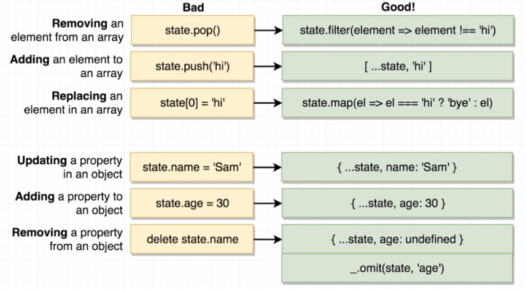

<h1>Brief description</h1>
Simple design to practice the use of redux and some tools with the react.

------------------------------

<h1>Organization of Components:</h1>


------------------------------

<h1>Used Tools</h1>


------------------------------

<h1>Redux, React-Redux and Redux-Thunk</h1>
<h3>Command:</h3>
npm install --save redux react-redux redux-thunk

Good practice in the reducers:


<h2>Redux-Thunk:</h2>
It's a middleware that change some rules of redux in the middle of dispatch and reducers, in this case it is used to make API call, without this I'm get a error because of the async call.

<h3>Documentation:</h3>
Give a look in the src folder: <br>
https://github.com/reduxjs/redux-thunk

------------------------------

<h1>OBS:</h1> 
node_modules folder is listed in .gitignore, so it is not in git because it is very heavy. 
Additional libraries, other than those created by create-react-app, are listed below, if necessary, use the command lines to install them in the node_module folder (npm commands listed below as well).

------------------------------

<h1> Semantic UI:</h1>
It's a library used to improve css production, comes with cool styles
<h3>Documentation:</h3>
https://semantic-ui.com/
<h3>How to use:</h3>
Go to this site: https://cdnjs.com/libraries/semantic-ui and get the 'semantic.min.css' link
add this link in the file ../public/index.html in a tag to be able to use it, like this:

```html
<link rel="stylesheet" href="https://cdnjs.cloudflare.com/ajax/libs/semantic-ui/2.4.1/semantic.min.css" />
```

------------------------------

<h1>Axios library:</h1>
It's used to make the API Request.
<h3>Command:</h3>
npm install --save axios

------------------------------

<h1>JSONPlaceholder API:</h1>
It's a API to get fake datas in JSON format, in this projec will be used fake blog posts and fake users.
<h3>Documentation:</h3> 
https://jsonplaceholder.typicode.com/

------------------------------

<h1>Lodash API:</h1>
It's an API with many functions to help in programming. In this case we used memoize function to manage how many times the fetch user calls the jsonPlaceholder, in the ./src/actions, without this function, the fetch function was calling jsonPlaceholder with the same params, 10 times the request with param user == 1 for example.
>>> After a little thought, it was decided not to use this option, then a more 'global' function was done that would work better in future cases, so was created a fetchPostsAndUsers action. Now, the lodash API is used to find the unique user Ids.
<h3>Command:</h3>
npm install --save lodash
<h3>Documentation:</h3> 
https://lodash.com/