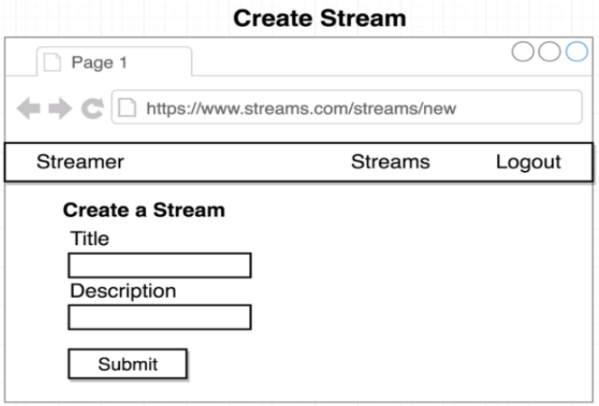

Project to create and watch streams, made to learn and improve skills in React.


<h1>App scheme</h1>
<h3>General:</h3>

<h3>Logged in/Logged out:</h3>

<h3>Pages:</h3>





------------------------------

<h1>Semantic UI:</h1>
It's a library used to improve css production, comes with cool styles
<h3>Documentation:</h3>
https://semantic-ui.com/
<h3>How to use:</h3>
Go to this site: https://cdnjs.com/libraries/semantic-ui and get the 'semantic.min.css' link
add this link in the file ./public/index.html in a tag to be able to use it, like this:

```html
<link rel="stylesheet" href="https://cdnjs.cloudflare.com/ajax/libs/semantic-ui/2.4.1/semantic.min.css" />
```

------------------------------

<h1>OAuth google login:</h1>
<h3>Documentation:</h3>
https://developers.google.com/api-client-library/javascript/reference/referencedocs
<h3>How to use:</h3>
Go to: https://console.developers.google.com/.
Create project, go into credentials, go on the OAuth consent screen and create, then go back to credentials and create credential OAuth client id, select web application and put link from website, in case it is http://localhost:3000
add a script tag in ./public/index.html:

```html
<script src="https://apis.google.com/js/api.js"></script>
```

------------------------------

<h1>React Router:</h1>

```bash
command: npm install --save react-router-dom@next
```
The normal version is bugged, then you have to @next to get the beta version

<h2>Router paths scheme</h2>


------------------------------

<h1>Redux, React-Redux and Redux-Thunk</h1>
<h3>Command:</h3>

```bash
npm install --save redux react-redux redux-thunk
```

<h2>Redux diagram</h2>


------------------------------

<h1>Redux Form:</h1>
<h3>Documentation:</h3>
https://redux-form.com

```bash
command: npm install redux-form@8.1.0
```

<br>
Using this version because the current one apparently has some bugs


------------------------------

<h1>Redux DevTools:</h1>
Help with debugging the application, helping with the state for example
<h3>Documentation:</h3>
https://github.com/zalmoxisus/redux-devtools-extension

------------------------------

<h1>Axios library:</h1>
It's used to make the API Request.
<h3>Command:</h3>

```bash
npm install --save axios
```

------------------------------

<h1>Portals:</h1>
Is used to relate a component directly to another component, for example, it was used here to create the modal directly in the X file, even when it was created when we called the delete button.

<h3>How to use:</h3>
In ./public/index.html, add a div, like:

```html
<div id="modal"></div>
```
And declare a Portal, like in ./components/Modal.js

------------------------------

<h1>JSON server:</h1>
Start the server in api folder with: npm start

------------------------------

<h1>Node-Media-Server:</h1>
Server to support the streaming.

<h3>How to use:</h3>
Create a new folder and run the following commands.

```bash
mkdir nms
cd nms
npm init
npm install node-media-server
```

Then create a index.js file and implement with the documentation on how to use the npm version.
After thath, replace the test script in package.json with:

```bash
"start": "node index.js"
```

<h3>Documentation:</h3>
https://github.com/illuspas/Node-Media-Server

