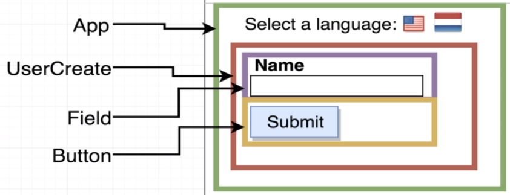
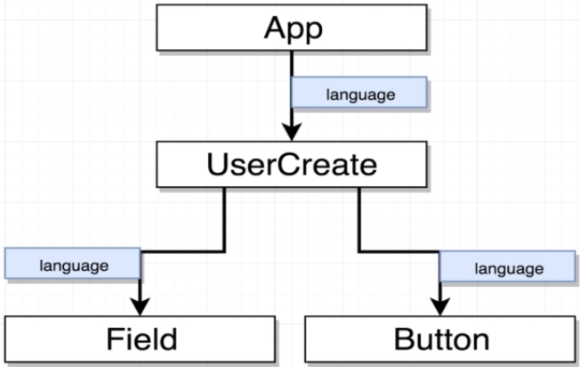
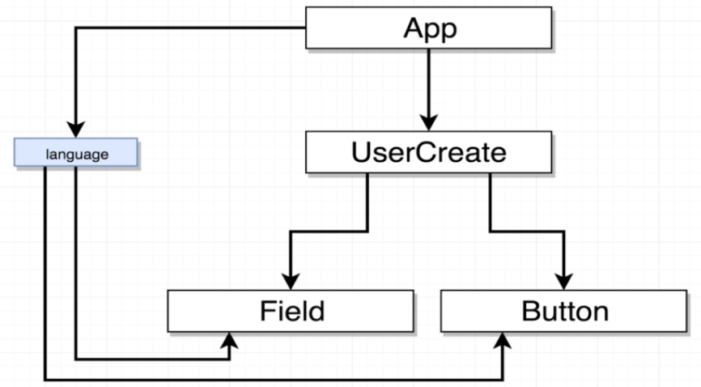
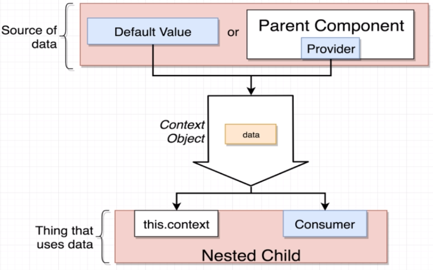

<h1>Brief description</h1>
Simple design to learn about React Context.

------------------------------

<h2>Components scheme:</h2>

<h2>Diagram if use just Props:</h2>

<h2>Diagram if use Context:</h2>

<h2>Ways to use Context:</h2>


------------------------------

<h1> Semantic UI:</h1>
It's a library used to improve css production, comes with cool styles
<h3>Documentation:</h3>
https://semantic-ui.com/
<h3>How to use:</h3>
Go to this site: https://cdnjs.com/libraries/semantic-ui and get the 'semantic.min.css' link
add this link in the file ../public/index.html in a tag to be able to use it, like this:

```html
<link rel="stylesheet" href="https://cdnjs.cloudflare.com/ajax/libs/semantic-ui/2.4.1/semantic.min.css" />
```