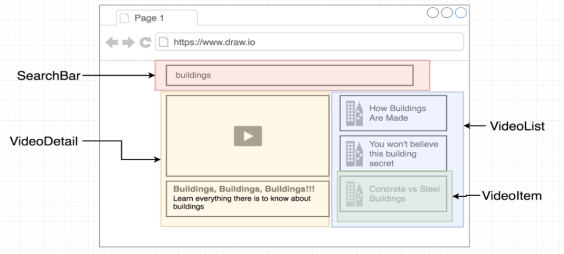

Organization of Components:

------------------------------

OBS: The node_modules folder is listed in .gitignore, so it is not in git because it is very heavy. 
Additional libraries, other than those created by create-react-app, are listed below, if necessary, use the command lines to install them in the node_module folder (npm commands listed below as well).

------------------------------

Semantic UI:
Is a library used to improve css production, comes with cool styles
documentation:
https://semantic-ui.com/

how to use:
go to this site: https://cdnjs.com/libraries/semantic-ui and get the 'semantic.min.css' link
add this link in the file ../public/index.html in a tag to be able to use it, like this:
<link rel="stylesheet" href="https://cdnjs.cloudflare.com/ajax/libs/semantic-ui/2.4.1/semantic.min.css" />

------------------------------

Axios library:
Used to make the API Request.
command: npm install --save axios

------------------------------

Youtube Data API V3:
how to use:
navegar para o site https://console.developers.google.com/
criar um novo projeto, habilitar o uso de APIs
procurar por Youtube Data API V3 e habilitar
criar as credenciais e pegar a API Key gerada
com o axios, fazer um get request em http://www.googleapis.com/youtube/v3, como feito no /api/youtube.js e chamando a função em: App.js > onTermSubmit()